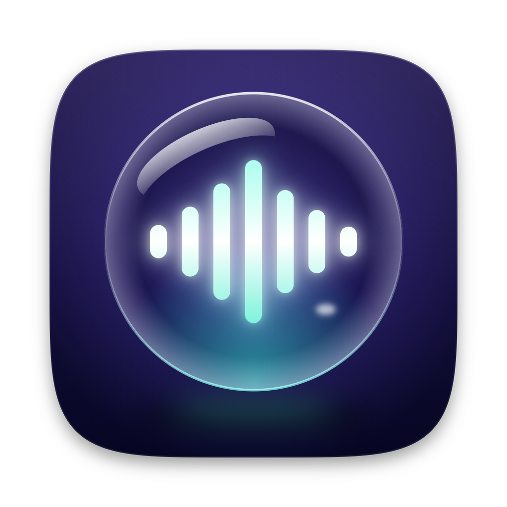
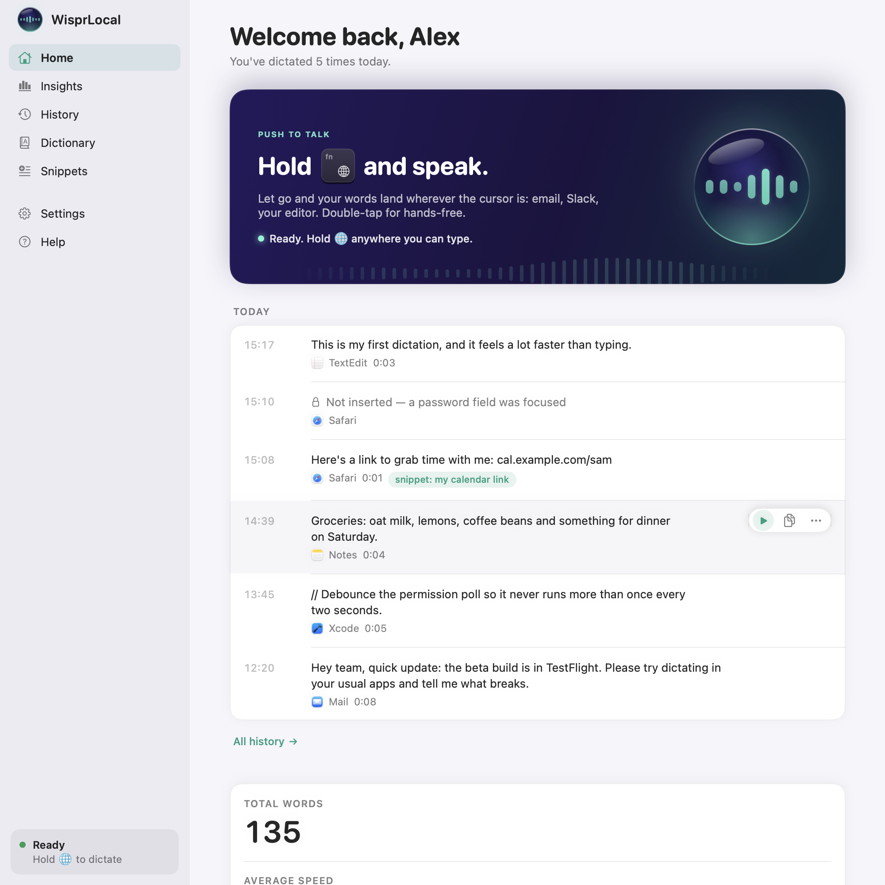
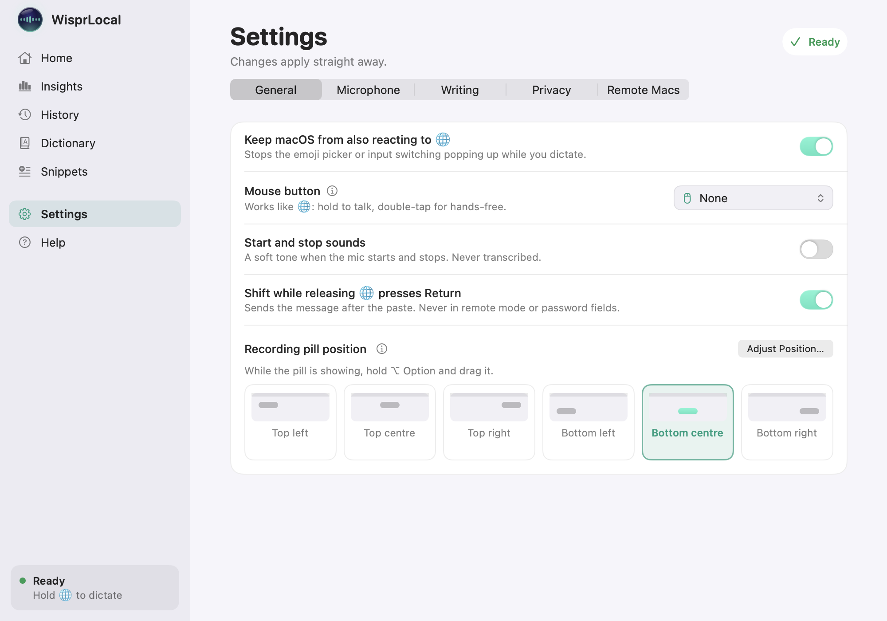
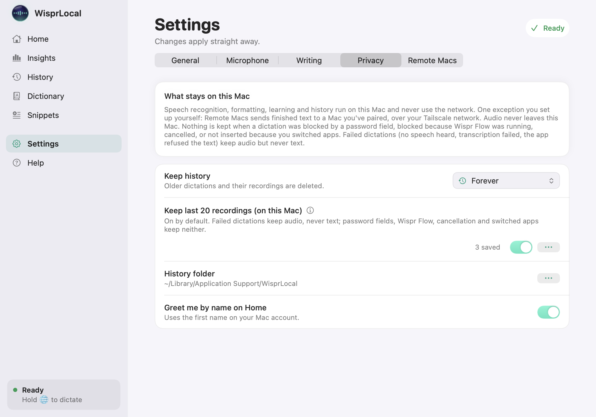

<p align="center">
  
</p>

<h1 align="center">WisprLocal</h1>

<p align="center">
  <b>Dictation for your Mac. Hold 🌐, speak, done. On-device recognition.</b>
</p>

<p align="center">
  <a href="#build-from-source">Build &amp; install</a> ·
  <a href="WisprLocal/docs/INSTALL.md">Install guide</a> ·
  <a href="WisprLocal/docs/TEST_REPORT.md">Test report</a> ·
  <a href="CHANGELOG.md">Changelog</a>
</p>

<p align="center">
  <a href="LICENSE"></a>
  
  
</p>

Speech recognition, cleanup, learning and history run on this Mac without network access. The only network feature is Remote Macs (Beta): finished text, never audio, is sent to a Mac you pair over your Tailscale network, authenticated with HMAC. Without pairing, WisprLocal types locally into a Screen Sharing window; WisprLocal uses no network for that fallback.

> WisprLocal is an independent alternative to Wispr Flow. Not affiliated with or endorsed by Wispr AI.

## Contents

- [Background: why this exists](#background-why-this-exists)
- [Features](#features)
- [Which model should I use?](#which-model-should-i-use)
- [Build from source](#build-from-source)
- [Using it](#using-it)
- [Privacy and the offline guarantee](#privacy-and-the-offline-guarantee)
- [Performance and accuracy](#performance-and-accuracy)
- [FAQ](#faq)
- [Older versions](#older-versions)
- [Contributing](#contributing) · [Credits](#credits) · [Licence](#licence)

## Install · Use · Status

- **Install:** source build only; macOS 26 or later on Apple Silicon. Follow [Build from source](#build-from-source).
- **Use:** hold 🌐 to talk, release to type; double-tap for hands-free.
- **Status:** version 1.0.0, published as source code only. There is no prebuilt download; build it from source (see [INSTALL.md](WisprLocal/docs/INSTALL.md)). P1–P3 are built. Settings was redesigned into five tabs on 2026-10-04; release builds use the hardened runtime. 911 tests in 157 suites passed on 2026-10-05 (network-denied run: 911 passed; socket-dependent and opt-in tests are skipped). The detailed manual checklist remains unchecked; Remote Macs is Beta and the manual two-Mac test is still pending. See [TEST_REPORT](WisprLocal/docs/TEST_REPORT.md) and [the live test inventory](WisprLocal/App/scripts/test_inventory.sh).

## Background: why this exists

The project was first called "Wispr Flow Lite", and the v2 code was briefly named "WisprLite", before it became WisprLocal. It began as a personal, for-fun project to see whether a cheaper alternative to Wispr Flow could be built.

It started in May 2025 as a Python command-line tool for push-to-talk dictation. It used cloud transcription: your audio was sent to OpenAI's Whisper API, and you needed your own API key. It then moved to Fireworks AI's hosted Whisper v3-turbo, which was much faster. The original project notes measured an average response of about 2.1 s with OpenAI (2058 ms) against about 0.7 s with Fireworks (693 ms), and 157 to 587 ms once silence was filtered out before upload. The cloud services improved over that period too.

In November 2025 it became a native Swift prototype, built to be faster and to feel native: a menu-bar app instead of a Python script in a terminal. It was still cloud-based.

Over 2025 and 2026 that stopped being necessary. Open speech models became good enough to run on a laptop: NVIDIA released Parakeet v2 in May 2025 and v3 in August 2025, and Moondream released Parakeet Ultra in September 2026. [FluidAudio](https://github.com/FluidInference/FluidAudio) made them run on the Apple Neural Engine from Swift, and macOS 26 added a language model that runs on the device.

In October 2026 the project was rebuilt as WisprLocal, a native Swift menu-bar app that works on-device, except Remote Macs, which sends finished text to a Mac you pair yourself. There is no account, no subscription and no audio leaving the Mac. It is free and MIT-licensed.

**A note on Wispr Flow.** The author has paid for Wispr Flow for over a year. WisprLocal is an experiment to see whether a fully offline version could meet the same everyday needs.

**Why two models.** English Parakeet v2 is the default. In our tests it was as accurate as Parakeet Ultra or better in quiet rooms (6.12 % vs 6.63 % word error on clean speech, a statistical tie), and it is English-only, so it can't switch language by mistake. Parakeet Ultra is for rooms with a TV or other voices, and for other languages. With TV speech competing at -6 dB it scored 7.6 % word error against 19 % for v2. Those figures come from synthetic voices fed straight to the models, without Apple's voice processing, so real rooms will differ. Details are in the [test report](WisprLocal/docs/TEST_REPORT.md) and the [model benchmark](WisprLocal/Spikes/S1b-models/RESULTS.md).

## Features

- **Hold 🌐 to talk, or double-tap for hands-free.** Text appears where your cursor is, in any app.
- **On-device speech recognition** on the Neural Engine, with Silero VAD trimming silence first. Two bundled models, one loaded at a time: **English (Parakeet v2)**, the fast default, and **Noisy room / other languages (Parakeet Ultra)**, better when a TV or other people are talking and able to transcribe 25 European languages (supported by the model, not yet tested by us). Switch from the menu bar or Settings.
- **Voice commands**: "scratch that" removes everything you said before it in the current dictation; "new line" and "new paragraph".
- **Snippets**: say a trigger such as "my calendar link" and the full text is typed.
- **Per-app styles**: Formal in email and documents, Casual in chats and AI tools (no full stop on a one-line message), Code in editors and terminals (no auto-capital). Only the first capital and the final full stop change, never your words. Pick a style per kind of app or per app in Settings › Writing; on by default.
- **Fix “actually” corrections** (opt-in): "coffee at 2, actually 3" becomes "coffee at 3". Only a time, number, day, month or name restated straight after "actually", "no", "sorry", "I mean", "make that" or "or rather"; anything else is typed as said. The pill shows **Corrected · Undo** for 8 seconds.
- **Personal dictionary**: fix names and jargon the model mishears (ships with "Wispr Flow" and "Tailscale" fixes). Dictionary words also pull close-sounding words that aren't English words to their spelling ("kuber netties" becomes "Kubernetes"; "cloud" never becomes "Claude").
- **Learns from your corrections**: retype something WisprLocal misheard and the indicator asks "Always write “kuber netties” as “Kubernetes”?"; **Add** puts the word in your dictionary and adds that rewrite (or it adds both automatically, or never; Settings › Writing). Ordinary English words, weekdays and numbers are never learned. Words you delete are never suggested again unless you add them back yourself. In apps that hide their text, use **Fix a Word…** in History.
- **Names from the text around your cursor** (opt-in, off by default): spells "Shaun" right when Shaun is in the email thread, and `getUserById` when it's in your editor. Read at the start of a dictation, kept in memory for that dictation only, subject to macOS secure input, your editable Never read list and banking-app category exclusions (which do not recognise every banking website).
- **Optional AI formatting** with Apple's on-device Foundation Models, behind a word-for-word guard requiring equal normalised word-token sequences plus case/layout checks. Prompt-injection resistance is tested, not absolute; see the [test report](WisprLocal/docs/TEST_REPORT.md#known-limitations-round-8-low-items-accepted-for-v1). Off by default.
- **History** of your dictations, stored locally, with delete and Clear All.
- **Insights**: usage and estimated time saved against typing at 40 wpm, based on the recorded speech and only inserted, non-empty dictations.
- **Noise reduction** using Apple's voice processing, for fans, hum and general noise (off by default: it can cut out quiet speech in very loud places, so try Check your microphone first; competing voices are what the Noisy room model is for).
- **Movable indicator**: put the recording pill wherever it isn't in your way.
- **Remote Macs (Beta)**: dictate into Screen Sharing, or pair the WisprLocal Receiver on the other Mac over Tailscale. Tested in software, not yet end to end on two real Macs.
- **Plays nicely with Wispr Flow**: if both are running, WisprLocal holds off so nothing is typed twice.

### AI formatting with Apple Intelligence

Every dictation gets quick rule-based cleanup: filler words like "um" go, spacing is fixed, sentences are capitalised, and "scratch that" works. On top of that you can switch on **AI formatting** in Settings › Writing. It uses Apple's on-device Foundation Models to tidy punctuation and turn spoken lists into bullets, with no network access.

- It is off by default, and it adds up to about 1.5 s per dictation. Even when it is off, list cues such as "first... second..." or "bullet point" request AI list formatting when Apple Intelligence is available and the word-for-word guard accepts the result; otherwise cleanup uses rules only.
- It needs Apple Intelligence turned on in System Settings, and macOS must have finished downloading its model. Settings › Writing shows whether it is ready when AI formatting is on. Until then WisprLocal uses the built-in rules.
- When text is confidently recognised as another language and has at least three words, it is typed as heard, with dictionary replacements. Short or uncertain text gets English cleanup.
- A guard checks every result. If the model changed your words, the result is discarded and the rule-based text is typed instead. History shows "rules" for those.

## Which model should I use?

| Your situation | Use | Why |
|---|---|---|
| Quiet room, English | **English (Parakeet v2)**, the default | As accurate or better on clean speech, and it can't switch language by mistake |
| TV on, or other people talking | **Noisy room (Parakeet Ultra)** | 7.6 % vs 19 % word error with competing TV speech in our synthetic-voice tests |
| Instrumental music playing | **English (Parakeet v2)** | Slightly better in the music test (7.25 % vs 8.16 %); a small difference |
| Another language | **Other languages (Parakeet Ultra)** | The only model that covers 25 European languages. Supported by the model, not yet tested by us |

Switch from the menu bar (**Noisy Room Mode**, a checkmark; unchecked means English, with the subtitle “Also understands 25 European languages”) or Settings › Microphone. Both models are bundled by default (`BUNDLE_MODELS`).

## Build from source

Building from source is the only way to install WisprLocal. There is no prebuilt download or GitHub Release, so you build the app yourself. You don't need to know Swift. The first build takes approximately 10 to 20 minutes, depending on the machine and connection.

### What you need

- [ ] An Apple Silicon Mac (M1 or later).
- [ ] macOS 26 or later.
- [ ] Xcode 26.6 or later (tested with 26.6 and 27) from the Mac App Store. It is a large download (the installed size is approximately 4 GB and varies by version, and Xcode also fetches extra components on first run). Open it once before you start.
- [ ] Approximately 5 GB of free disk space: roughly 1 GB for models, 2.7 GB of build files and 1.1 GB for the app; sizes depend on the machine and build.
- [ ] An internet connection for the first build only, to download Swift packages and the models from Hugging Face. The first build needs a few GB of disk. Speech recognition and cleanup never use the network; the only network feature is Remote Macs, which you pair yourself.
- [ ] Approximately 10 to 20 minutes the first time, depending on the machine and connection.
- [ ] Optional: Apple Intelligence turned on, for AI formatting only.
- [ ] Optional: Tailscale on both Macs, for Remote Macs (Beta).

### Steps

1. **Set up Xcode once.** Open Xcode from Applications and let it finish installing components. Then, in Terminal:

   ```bash
   sudo xcode-select -s /Applications/Xcode.app/Contents/Developer
   sudo xcodebuild -license accept
   ```

2. **Get the code.**

   ```bash
   git clone https://github.com/tommyyau/wisprlocal.git && cd wisprlocal/WisprLocal/App
   ```

3. **Create the signing identity (once).**

   ```bash
   scripts/create_signing_identity.sh
   ```

   This makes a certificate on your own Mac. It matters because macOS ties your Microphone, Accessibility and Input Monitoring permissions to the app's signature. Without a stable one, the permissions reset on every rebuild. macOS may ask for your login password.

4. **Build the app.**

   ```bash
   scripts/build_app.sh
   ```

   The first run downloads the two speech models and the voice-detection model once from Hugging Face, at pinned Hugging Face revisions, about 1 GB in total. `scripts/model-manifest.sha256` pins SHA-256 for every shipped model file; `fetch_models.sh`, `build_app.sh` and `verify_bundle.sh` verify against it. The app does not re-hash at runtime. The downloaded model files are cached in `WisprLocal/App/.models-cache/` (not tracked by git), so later builds don't download again. The app is written to `WisprLocal/App/build.noindex/WisprLocal.app`. Compiling takes a few minutes.

5. **Install it.**

   ```bash
   scripts/install.sh
   ```

   This copies the app to `~/Applications/WisprLocal.app`. Open it from there.

6. **Free up the Globe key.** Open System Settings › Keyboard and set **Press 🌐 key to** to **Do Nothing**. Otherwise the emoji picker or input switching can pop up while you talk. The first-run setup window’s 🌐 step shows the reminder whenever macOS’s 🌐 action is not **Do Nothing**. Settings shows it only when that action is not **Do Nothing** and **Keep macOS from also reacting to 🌐** is off (it is on by default).

7. **First launch.** Grant **Microphone**, **Input Monitoring** and **Accessibility** when the setup window asks, and relaunch if it offers. Preparing a speech model for the first time — on first launch, after each macOS update, or the first time you switch to the other model — took 7–12 s in the latest measurement and 18–23 s in the original spike; after that it loads in well under a second. Then hold 🌐 (Globe / fn) and speak.

### Updating later

```bash
git pull && scripts/build_app.sh && scripts/install.sh
```

The app version comes from `WisprLocal/App/VERSION`. Both apps are signed with the hardened runtime. A build signed with a different identity than before needs Microphone, Accessibility and Input Monitoring permissions granted again.

Run it from `WisprLocal/App`. The scripts use a stable local signing identity when one exists, otherwise ad hoc; permissions persist only with a stable identity.

### Build fails? Common errors

- **Xcode licence not accepted.** `swift build` stops and the command exits with status 69, mentioning the Xcode license agreement. Run `sudo xcodebuild -license accept`, then run `scripts/build_app.sh` again.
- **"requires Xcode, but active developer directory ... is a command line tools instance".** `xcode-select` points at the Command Line Tools instead of Xcode. Run `sudo xcode-select -s /Applications/Xcode.app/Contents/Developer`.
- **A big boxed "WARNING: AD-HOC CODE SIGNING" in the build output.** The signing identity is missing, so permissions would reset on every rebuild. Run `scripts/create_signing_identity.sh` once, rebuild, reinstall and grant the permissions again. If macOS asks whether `codesign` may use the key, click Always Allow.
- **The model download was interrupted.** Run `scripts/build_app.sh` again. The download step skips models already in `.models-cache/`, so it is safe to repeat. If one model folder is half-written, delete that folder inside `WisprLocal/App/.models-cache/` and rerun.
- **Permissions don't stick, or System Settings shows them on but dictation does nothing.** Check that you ran `scripts/create_signing_identity.sh` before building. Then remove WisprLocal from Accessibility and Input Monitoring, add `~/Applications/WisprLocal.app` again, and relaunch. If it still fails, `tccutil reset All com.tommyyau.wisprlocal` clears every grant.
- **The first word is cut off.** Starting the mic mutes its first fraction of a second. With noise reduction on or off, WisprLocal keeps the mic ready for 60 seconds after each dictation. Set **Microphone readiness (Settings › Microphone)** to **Ready for 60 s after dictating** or **Always on**. Noise reduction follows the same readiness setting; Bluetooth inputs stay closed while idle. See the [FAQ](#why-is-the-orange-mic-dot-on-after-i-dictate).

More help, and how to uninstall, are in [INSTALL.md](WisprLocal/docs/INSTALL.md#troubleshooting).

### For developers

Run these from `WisprLocal/App`:

```bash
swift build                      # debug build
swift test                       # unit and integration tests (Swift Testing)
scripts/test_offline.sh          # after scripts/fetch_models.sh; the tests (socket-dependent and opt-in tests are skipped); network denied
scripts/privacy_scan.sh          # fail if personal data is tracked
```

The first `swift build` downloads the FluidAudio package from GitHub, plus a prebuilt NemoTextProcessing artifact that WisprLocal does not link. `scripts/fetch_models.sh` downloads the models from Hugging Face unless local copies are available. The app itself never uses the network for dictation.

Built and tested with Xcode 27 (Swift 6.4) locally and with Xcode 26.6 (Swift 6.3) in CI, both on macOS 26. The package declares swift-tools 6.2; Swift 6.2 itself is untested. To choose which models are bundled, set `BUNDLE_MODELS` (default `v2,ultra`); each is pinned to an exact revision (v2 `ee09c569f73759e6d44c9bd16766f477b2b36d39`, Ultra `95eaa59a39d4394f047a4dc5cce480388a60d1b6`).

To debug a misrecognition, keep Settings › Privacy › "Keep last 20 recordings (on this Mac)" on (the default), then replay a clip offline with `swift run WisprLocalReplay <clip.wav>`. To compare both models on your own voice, use the app for a day with recordings on and run `swift run -c release WisprLocalReplay --compare-all`. It re-transcribes every saved clip with both models, side by side, and summarises the differences (split by voice processing on/off). `--bench-switch` times model switching.

More answers (troubleshooting, permissions and uninstalling) are in [INSTALL.md](WisprLocal/docs/INSTALL.md).

## Screenshots

Screenshots are rendered from the app's preview harness at release time. Sample data is synthetic: “Alex” and the example dictations.


Home shows recent dictations and their outcomes.


General settings contains shortcut and recording controls.


Privacy settings explains what is kept and controls history and recordings.

## Using it

**Practise both recording modes.** The Welcome Tour covers permissions, the Globe / fn key, hold-to-talk practice, hands-free practice, and finishing, cancelling or recovering a dictation. Reopen it from **Help › Getting Started…**. Home's **Getting started** cards include all the recording controls; Help's **How to use** page has the complete guide, including setup, spelling corrections, troubleshooting, microphone/model choices and privacy controls.

Click into the text field you want to use before recording. Hold 🌐 while you speak, then release it to finish and type. For hands-free, tap 🌐 twice quickly, let go and speak; click **Done** on the recording pill or tap 🌐 once more to finish. A single quick tap while idle is discarded. Finishing types your words; cancelling before the paste discards them. Cancelling can't remove text that's already been typed.

| Do this | To |
|---|---|
| **Hold 🌐**, speak, let go | Record while held; release to finish and type (up to 5 minutes) |
| **Double-tap 🌐**, speak, click **Done** on the pill or tap once more | Dictate hands-free (up to 10 minutes) |
| **Esc** while recording or processing, before the paste | Cancel: nothing is typed (over 30 s, press Esc twice) |
| **Triple-tap 🌐 to cancel** while recording hands-free | Discard the current dictation: nothing is typed |
| **⌃⌥⌘V** (Control–Option–Command–V) in a text field | Paste the most recent dictation's text from this session, including after an app switch or a failed paste |
| Hold **Shift** as you let go of 🌐 | Press Return after the paste, to send a chat message (not in remote mode or while macOS secure input is enabled) |
| Say **"scratch that"** as a separate sentence in English | Remove everything you said before it in the current dictation |
| Say **"new line"** / **"new paragraph"** as separate commands in English | Insert a line break / a blank line |
| Say a **snippet trigger** on its own | Type the whole snippet |
| **Dictionary** (main window) | Teach it names and terms, or replace a common mishearing |
| Retype a word it got wrong, then **Add** on the indicator | Teach it that spelling for next time |
| **History › ••• › Fix a Word…** | The same, for apps that hide their text (Slack, Claude, VS Code) |
| **Settings › General** | Move the recording pill (per display) |
| right-click the pill (**Hide Indicator for 1 Hour**) | Hide the pill for an hour; dictation keeps working (**Indicator Hidden — Show** in the menu bar brings it back) |
| **Settings › General** | Add a mouse button as push-to-talk, choose start/stop sounds (off by default) or Shift-to-send (on by default) |
| **Settings › Writing** | Choose how each kind of app is punctuated, and turn on Fix “actually” corrections |

**The menu bar menu.** Click the WisprLocal icon in the menu bar. When something needs you, the top line says what, and clicking it does the fix: **Permission Needed — Fix…**, **Wispr Flow Is Active — Use WisprLocal Anyway…**, **Speech Model Unavailable — Retry**, **Loading Speech Model…**, **Recording…**, **Indicator Hidden — Show** or **Mic Ready · 0:42 — Stop**. When all is well there is no status line. Below it: **Open Dashboard** (opens Home), **Settings…** (⌘,), a separator, **Noisy Room Mode** (checked = Parakeet Ultra, unchecked = English Parakeet v2) with the subtitle “Also understands 25 European languages”, a separator, **Help** (Help & FAQ…, Getting Started…, Credits…, About WisprLocal…), a separator and **Quit WisprLocal** (⌘Q). Copy dictations from Home or History, and hide the indicator from the pill's right-click menu (the menu bar shows **Indicator Hidden — Show**). The icon itself changes with the state: a thicker ring while the mic is ready, a solid orb while recording, a slash while holding off for Wispr Flow, and a dot when something needs attention.

**Using it alongside Wispr Flow.** You can have both installed, and Wispr Flow gets priority. While it's running, WisprLocal stays completely out of the way: 🌐 passes straight through to Wispr Flow (and macOS), WisprLocal's mic stays off and nothing is transcribed or typed. A short notice says so (also at the top of the menu bar menu and in a banner at the top of Settings), with **Quit Wispr Flow**, **Use WisprLocal anyway** (both apps may then type the same words; it lasts until Wispr Flow quits or relaunches) and a shortcut option. When Wispr Flow quits, WisprLocal works again on its own. If you've moved Wispr Flow off the 🌐 key, turn on **Settings › General › Wispr Flow uses a different shortcut** and both apps run side by side.

At insertion time, WisprLocal checks that the frontmost app (process and bundle) is still the one you started in. If it changed, the text is copied to the clipboard instead. Changes of window or field within the same app are not detected. WisprLocal relies on macOS secure input. When that signal is on, nothing is inserted; no text or audio is kept; History shows only the time, the outcome and the app. Fields that do not enable it are not detected. Only delivered dictations keep text in History.

## Remote Macs (Beta)

> **Beta.** Built, unit-tested and tested over a loopback connection, but **not yet tested end to end on two real Macs** over Screen Sharing and Tailscale. Expect rough edges and please report them.

Dictate on your Mac and have the text appear on another Mac you're controlling with Screen Sharing. For the most reliable result, run **WisprLocal Receiver** (a separate app, built with `scripts/build_receiver.sh`) on the remote Mac and pair them over Tailscale. See **[REMOTE.md](WisprLocal/docs/REMOTE.md)**.

## Privacy and the offline guarantee

Automatic dictated-text clipboard writes (paste, focus-changed copy and failed-insert copy) use Concealed + Transient markers and are current-host-only. The two Screen Sharing writes (clipboard-delay fallback and pairing code) keep the markers but are not current-host-only. Copy buttons you click write ordinary clipboard text.

Speech recognition, cleanup, learning and history run on this Mac without network access. The only network feature is Remote Macs (Beta): finished text, never audio, is sent to a Mac you pair over your Tailscale network, authenticated with HMAC. Without pairing, WisprLocal types locally into a Screen Sharing window; WisprLocal uses no network for that fallback. There's no account, no telemetry and no analytics. This is checked by machinery, not just promised:

- **Source scan**: [`OfflineGuardTests`](WisprLocal/App/Tests/WisprLocalCoreTests/OfflineGuardTests.swift) fails the build's test suite if any networking API (`URLSession`, `NWConnection`, `http(s)` strings, `curl`, model download calls and more) appears anywhere in the app's source, except the opt-in remote bridge.
- **Network-denied test run**: [`scripts/test_offline.sh`](WisprLocal/App/scripts/test_offline.sh) runs the tests (socket-dependent and opt-in tests are skipped) inside a macOS sandbox that blocks all network access, and first proves the block works by making a download fail.
- **No download path**: the installed app loads models from inside its bundle, with the library's offline mode forced on. Developer builds and tools also honour `WISPRLOCAL_MODELS_DIR`. `scripts/model-manifest.sha256` pins SHA-256 for every shipped model file; `fetch_models.sh`, `build_app.sh` and `verify_bundle.sh` verify against it. The app does not re-hash at runtime.

The one exception is a feature you turn on yourself: **Remote Macs (Beta)** pairing sends finished text (never audio) to your own paired Mac, only to a Tailscale address, authenticated with a shared key. Without pairing, WisprLocal types locally into a Screen Sharing window, with no network use by WisprLocal. Details in [REMOTE.md](WisprLocal/docs/REMOTE.md).

**The orange mic dot after you dictate.** Starting the microphone mutes its first ~0.2 s, which used to cost the first word of a quick follow-up dictation. With noise reduction on or off, WisprLocal keeps the mic running for 60 seconds after each dictation (**Microphone readiness (Settings › Microphone)**), and macOS shows its orange dot meanwhile; when the menu shows “Mic Ready · 0:42”, counting down, choose Stop to stop the mic now. Warm audio is held in memory only. When a dictation starts, the last ~0.3 s is prepended and becomes part of that dictation and its recording if recordings are on. Unused warm audio is never saved or sent. The warm buffer is zeroed when the 60 s end and at once on screen lock, sleep, a user switch, secure input, WisprLocal holding off for Wispr Flow, or quit. **Always on** (off by default) keeps the mic on whenever the app runs. Noise reduction follows the same readiness setting. Bluetooth microphones stay closed while idle so AirPods retain music quality; each dictation starts cold while they switch modes. The built-in Mac mic avoids this switch.

You can change the History folder in Settings › Privacy › History folder. If you choose a cloud-synced folder, your history syncs with it.

Stored on your Mac, in `~/Library/Application Support/WisprLocal/` (readable only by your user account): your dictionary (plus `learning.json`: the words it learned and the ones you deleted), your history and the last 20 troubleshooting recordings, on by default. Turn recordings off in Settings › Privacy › Keep last 20 recordings. When a dictation is blocked by macOS secure input, blocked while WisprLocal is holding off for Wispr Flow, or cancelled, no text or audio is kept; History shows only the time, the outcome and the app. After an app switch or a failed paste, the text is not saved in History or recordings; the text is copied to the clipboard so you can paste it, and kept in memory until you quit for ⌃⌥⌘V. Failed dictations (no speech heard, transcription failed, the app refused the text) keep audio if Keep last 20 recordings is on, but never text. WisprLocal's system log never contains what you dictated.

**Smart dictionary and what it reads.** After a paste, WisprLocal watches the same text field for up to 15 seconds to spot a word you retype. It reads only what it typed plus 200 characters on each side, once a second, and never in address bars, fields with secure input enabled or apps on your editable Never read list; what it sees stays in memory and only the corrected word is kept. **Names and terms near your cursor** is off by default. When on, it reads up to 2,000 characters on each side of the cursor, the window title and, in Mail or Outlook, the To and From names, at the start of each dictation. Never read: address bars and fields with macOS secure input enabled. The Never read list is editable; password managers and Keychain Access are defaults you can remove. Banking apps are skipped by macOS app category, which does not recognise every banking website. The names it finds are held in memory for that one dictation and History records only how many words they corrected.

## Performance and accuracy

All figures come from the [test report](WisprLocal/docs/TEST_REPORT.md), measured on an Apple M5 Pro running macOS 26.6.2.

| | Result |
|---|---|
| Word error rate, clean speech | English (Parakeet v2) 6.12 %, Noisy room (Parakeet Ultra) 6.63 % (a statistical tie on this set) |
| Word error rate, TV speech in the background (-6 dB) | Ultra 7.55 %, v2 19.03 %. Measured by feeding audio straight to the models, without the app's voice processing; real-world gaps may differ. |
| Transcription time, 28 s of speech (warm) | v2 211 ms, Ultra 153-383 ms |
| Switching models | 0.15-0.19 s once each model has been prepared. Preparing a speech model for the first time — on first launch, after each macOS update, or the first time you switch to the other model — took 7–12 s in the latest measurement and 18–23 s in the original spike; after that it loads in well under a second. |
| Release-to-text, Parakeet Ultra, fixture clip, release build | 75 ms median, measured after the capture tail ends (the tail is adaptive, 150-400 ms: it stops after 120 ms of silence; the 75 ms profile predates it and excluded the then-fixed 200 ms tail). AI formatting skipped on already-clean text |
| Speech engine memory (peak RSS, benchmark process) | v2 172 MB, Ultra 231-259 MB. Only the active model is loaded |
| Stability | Ultra 15-minute soak: 9,004 calls, 0 hangs, 0 errors. v2: 500 calls, 0 hangs, 0 errors |
| Automated tests | 911 tests in 157 suites passed on 2026-10-05 (network-denied run: 911 passed; socket-dependent and opt-in tests are skipped) ([current inventory](WisprLocal/App/scripts/test_inventory.sh)) |

Honest limits: the maintainer confirmed basic dictation on a 1.0.0 build from 2026-10-05, before the final pre-publication fixes on 2026-10-05; the detailed manual GUI checklist remains unchecked and the two-Mac remote run is still pending. Every accuracy number used **synthetic voices** (macOS `say`) on small test sets, so real-world error rates will differ, probably upward. Only one machine was measured; M1-class Macs are expected to be slower. Real-voice and older-Mac results will be added as they are measured.

## FAQ

### Does anything leave my Mac?

Speech recognition, cleanup, learning and history run on this Mac without network access. The only network feature is Remote Macs (Beta): finished text, never audio, is sent to a Mac you pair over your Tailscale network, authenticated with HMAC. Without pairing, WisprLocal types locally into a Screen Sharing window; WisprLocal uses no network for that fallback.

This is checked, not just promised: the tests (socket-dependent and opt-in tests are skipped) also run inside a macOS sandbox that blocks all network access, after first proving the block works. The only network feature is the optional Remote Macs beta, which sends text to your own paired Mac over Tailscale.

### Which speech model should I use?

Start with English (Parakeet v2), the default. On clean speech it matched or beat the alternative in our tests (6.1 % word error rate vs 6.6 %), and it was also better on long dictations and with music playing.

Switch on Noisy room / other languages (Parakeet Ultra) if a TV or other people are often talking while you dictate. With TV speech at −6 dB behind the speaker, Ultra scored 7.6 % against 19.0 % for v2. Measured by feeding audio straight to the models, without the app's voice processing; real-world gaps may differ.

There are two separate noise tools. Noise reduction (Apple voice processing, in Settings › Microphone, off by default) suppresses steady noise like fans and hum at the mic, but can cut out quiet speech in very loud places; try Check your microphone first. The Noisy room model handles competing voices and other languages. Speaker focus, which would follow only your voice, is planned but not built.

Those tests used synthetic voices on a small set, so treat them as a guide. You can compare both models on your own voice: see How to compare models on your own voice in the test report in the project's GitHub repository.

### Why did my English come out in another language?

That can happen with Noisy room / other languages (Parakeet Ultra). It can transcribe 25 European languages (supported by the model, not yet tested by us), and on a very short phrase it occasionally picks the wrong one.

English (Parakeet v2) only speaks English, so switching back avoids language switching. Text confidently recognised as another language with at least three words is typed as heard; short or uncertain text gets English cleanup.

### What does cleanup do, and why does History say “rules”?

Every dictation gets quick rule-based cleanup: filler words like “um” go, “scratch that” removes everything you said before it in the current dictation, spacing is fixed and sentences are capitalised. That's what “rules” means in History.

AI formatting (off by default) adds Apple Intelligence for punctuation (up to 1.5 s). Spoken list cues use it even when AI formatting is off. A guard checks every AI result; if the model changed your words, your own words are typed and History still says “rules”.

Two final touches are rule-based too. Styles (Settings › Writing, on by default) only change the first capital and the final full stop to suit the app, so a chat gets no full stop and an email gets one. Fix “actually” corrections (off by default) types just the value you restated: “at 2, actually 3” becomes “at 3”, with Undo on the pill for 8 seconds, or “Corrected · can't undo here” with Copy original when undo is unavailable.

When text is confidently recognised as another language and has at least three words, it is typed as heard, with dictionary replacements. Short or uncertain text gets English cleanup.

### Why the permissions, and why might they reset?

Microphone, to hear you while 🌐 or a chosen mouse button is held, during hands-free, during the three-second mic test and while the mic is kept ready. Input Monitoring, to notice the 🌐 key from any app. Accessibility, to type the words where your cursor is.

macOS ties each grant to the app's code signature. A copy signed differently, such as an unsigned rebuild, counts as a new app, so System Settings can show WisprLocal as ON while the grant belongs to the old copy. WisprLocal spots this and shows a stale-permission fix.

### How do I add names or jargon?

Open Dictionary. Add Words for spellings to keep exactly, and Replacements for what the model keeps mishearing, such as “cooper netties” to “Kubernetes”. Words also pull close-sounding words that aren't English words to their spelling, so “kuber netties” becomes “Kubernetes” when it can only mean that one word; a real word such as “cloud” is never changed to “Claude”.

Or let WisprLocal learn: when you fix something it misheard, it asks “Always write “kuber netties” as “Kubernetes”?”. Add puts the word in Words and adds that Replacement (Settings › Writing › Learn words from my corrections: Suggest, Add automatically or Off). In apps that hide their text, use Fix a Word… on the dictation in History. Words and fixes you delete from the dictionary are never suggested again unless you add them back yourself.

Replacements run on every dictation, in any language, and have negligible cost.

### What hardware do I need?

A Mac with Apple Silicon running macOS 26 or later.

All our measurements were made on an Apple M5 Pro. An M1 Pro has not been tested yet; its Neural Engine is slower, so expect dictation to take a little longer there.

### Where's my data, and how do I delete it?

History and your dictionary live in ~/Library/Application Support/WisprLocal, readable only by your user account. Only delivered dictations keep text. When a dictation is blocked by macOS secure input, blocked while WisprLocal is holding off for Wispr Flow, or cancelled, no text or audio is kept; History shows only the time, the outcome and the app. After an app switch or a failed paste, the text is not saved in History or recordings; the text is copied to the clipboard so you can paste it, and kept in memory until you quit for ⌃⌥⌘V. Failed dictations (no speech heard, transcription failed, the app refused the text) keep audio if Keep last 20 recordings is on, but never text. learning.json in the same folder, also readable only by your user account, lists learned words and deleted words and misheard forms. Deleted words are never suggested or used for spelling again unless you add them back yourself. It holds those words only, never dictated text.

To space and capitalise new text, WisprLocal reads up to 64 characters before the cursor and up to 1,000 selected characters. Secure fields and apps excluded by the Never read list or banking/finance app category are skipped; address bars expose only one preceding character for spacing, never selected text. The editable list defaults to password managers and Keychain Access; app categories do not recognise every banking website. To offer Undo after a correction, and check it again when you choose Undo, WisprLocal re-reads the text it typed plus one preceding character, without the Never read list or app-category checks. If a range read fails, some apps only let it read the whole field, from which it keeps just the characters needed for spacing or Undo. These reads stay in memory only and are never saved. Names and terms near your cursor (off by default) reads the text near your cursor, the window title and, in Mail or Outlook, the To and From names, when each dictation starts. It uses the same app exclusions and never reads address bars or fields with macOS secure input enabled. The names it finds stay in memory for that one dictation and are never saved; History only counts how many words they corrected.

Delete single entries or Clear All in History; that also deletes their recordings. To keep less, set Settings › Privacy › Keep history to 30 days, 7 days or 24 hours: older dictations and their recordings are then deleted at launch and every hour. Recordings are on by default: the last 20 dictations are kept as audio in the DebugRecordings folder there, so you can replay them and compare Heard vs Inserted in History. That includes failed dictations where nothing came out, so you can hear why. When a dictation is blocked by macOS secure input, blocked while WisprLocal is holding off for Wispr Flow, or cancelled, no text or audio is kept; History shows only the time, the outcome and the app. After an app switch or a failed paste, the text is not saved in History or recordings; the text is copied to the clipboard so you can paste it, and kept in memory until you quit for ⌃⌥⌘V. Failed dictations (no speech heard, transcription failed, the app refused the text) keep audio if Keep last 20 recordings is on, but never text. They never leave your Mac. Turn them off in Settings › Privacy › Keep last 20 recordings, or delete them all at once there.

### Why does dictation cut out or miss words in loud places?

In very loud places (planes, trains), a headset mic close to your mouth works far better than the built-in mic. The laptop mic hears everyone nearby, and WisprLocal can type what the people next to you say; speaker focus, which would follow only your voice, is planned but not built.

Noise reduction (Apple voice processing) can cut out quiet speech in very loud places. On a plane, 15 of 20 dictations with it on had speech silenced (typically 10 %, in gaps of up to half a second), so it is now off by default. If you turned it on and WisprLocal says your mic audio is cutting out, turn it off in Settings › Microphone, or set Mic Mode to Standard (Voice Isolation blocks even more).

When the mic heard you but no words came out, WisprLocal says “Didn't catch that”. See why shows the numbers and lets you replay the recording. Check your microphone, in Settings › Microphone, tests your mic with your current settings; only when noise reduction is on does it repeat with it off and show both side by side.

### Why is the orange mic dot on after I dictate?

Starting the microphone takes about a fifth of a second, and macOS mutes that moment, so a quick follow-up dictation used to lose its first word. With noise reduction on or off, WisprLocal keeps the mic ready for 60 seconds after each dictation, and macOS shows the orange dot while it does. When the menu shows “Mic Ready · 0:42”, counting down, choose Stop to stop the mic now.

Warm audio is held in memory only. When a dictation starts, the last ~0.3 s is prepended and becomes part of that dictation and its recording if recordings are on. Unused warm audio is never saved or sent. It's cleared when the 60 seconds end, and at once on screen lock, sleep, a user switch, secure input, WisprLocal holding off for Wispr Flow, or quit.

Choose Off in Settings › Microphone › Microphone readiness. Or choose Always on there to keep the first word in almost every case; a cold start can still clip it, at the cost of the dot staying on. With noise reduction on, the mic stays ready for 60 seconds after dictating when Ready for 60 s after dictating is selected, just like the warm raw mic, and the orange dot shows during that time. Always on keeps it on until stopped. While noise reduction is kept ready, macOS may turn down other audio (ducking), and the orange mic dot shows.

With noise reduction off, Bluetooth mics follow these readiness settings. With noise reduction on, Bluetooth mics close after each dictation so AirPods return to music quality. After the Bluetooth mic closes, the next dictation is a cold start and may take a little longer while AirPods switch modes. Using the built-in Mac mic avoids this switch.

### Who made the models?

English (Parakeet v2) is NVIDIA's parakeet-tdt-0.6b-v2. Noisy room / other languages is Moondream's Parakeet Ultra, built on NVIDIA's parakeet-tdt-0.6b-v3. Silero VAD is by the Silero Team. FluidInference converted all three to Core ML; their FluidAudio library runs our speech recognition and speech detection.

Both Parakeet models are CC-BY-4.0, Silero VAD is MIT, and FluidAudio is Apache-2.0. WisprLocal bundles the model files unmodified at pinned revisions. Full credits, sources, licences and conversion notes are in ACKNOWLEDGEMENTS.md and in the app under Help › Credits.

## Older versions

The earlier Python CLI and cloud prototype are not part of this repository.

## Contributing

Issues and pull requests are welcome. Please read [CONTRIBUTING.md](CONTRIBUTING.md) first, and report security issues privately as described in [SECURITY.md](.github/SECURITY.md).

## Credits

**FluidAudio by FluidInference is essential to WisprLocal**: it loads and runs our Parakeet speech-recognition models and Silero voice activity detection. We use its Swift library under Apache-2.0.

The app bundles three models, unmodified at pinned revisions:

- **Parakeet TDT 0.6B v2** — default English recognition; by NVIDIA, converted to Core ML by FluidInference; CC-BY-4.0.
- **Parakeet Ultra** — noisy-room and multilingual recognition; Moondream's post-training of NVIDIA's Parakeet v3, converted to Core ML by FluidInference; CC-BY-4.0.
- **Silero VAD** — speech detection and outer-silence trimming; by the Silero Team, converted to Core ML by FluidInference; MIT.

Thank you to those teams, and to Apple for the system frameworks and optional on-device formatting. Full credits, source links, pinned revisions, licences and conversion notes are in [ACKNOWLEDGEMENTS.md](ACKNOWLEDGEMENTS.md) and **Help › Credits…** in the app. Licence copies and model notices ship inside each packaged build.

## Licence

MIT covers the repository code; models and FluidAudio carry their own licences. See [ACKNOWLEDGEMENTS](ACKNOWLEDGEMENTS.md).

WisprLocal is released under the [MIT License](LICENSE). Bundled models and libraries keep their own licences, listed in [ACKNOWLEDGEMENTS.md](ACKNOWLEDGEMENTS.md).
